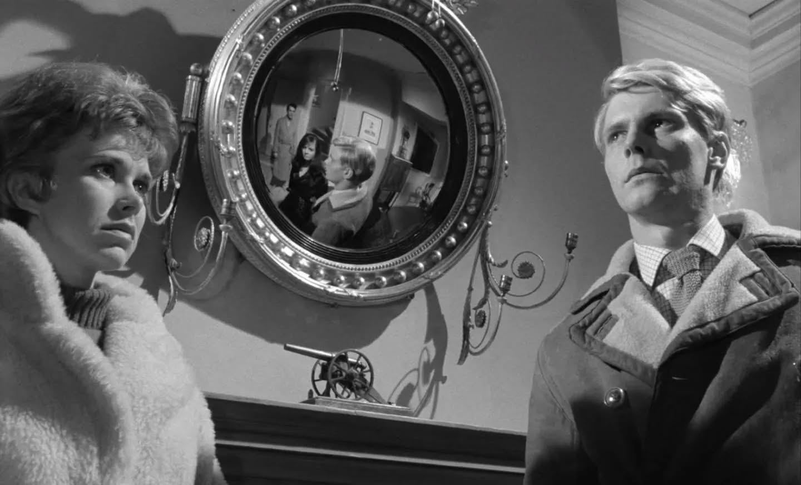

{.lightbox}

::: {.column-margin}

FILM 271-01-FA25  
[Keene State College](https://keene.edu)\
Department of Film\
Fall Semester 2025\
Monday 10:00 a.m.-1:30 p.m.\
Parker Hall: Drenan Auditorium\
Instructor: Dr. Martin Roberts\
Office hours: Monday 16:00-17:00\
Office location: Media Arts 124\
[Canvas](https://keene.instructure.com/courses/2474966)\
 
[](mailto:mdy45@usnh.edu) \| [](https://merveilles.town/@dokoissho) \| [](https://github.com/mroberts1/ksc-film-history-fa25)\| 
[](https://bsky.app/profile/dokoissho.bsky.social)

:::

<small>Wendy Craig, James Fox, Dirk Bogarde, Sarah Miles in The Servant (Joseph Losey, 1963)</small>

## Overview

This course provides an introduction to the study of the history of world cinemas and filmmaking over the past century. Students are introduced to national cinemas, film movements, genres, major directors/auteurs, and historically significant films. Films are contextualized within both to the history of film itself and the larger historical contexts from which they emerged. They are explored in relation to a wide range of analytical frameworks and concepts. Course assignments provide the opportunity to study historical film movements and pursue research on the works of specific directors.

## Outcomes

By the end of the course, students will have acquired an in-depth understanding of a wide range of historically significant national cinemas, film movements, major directors, and films. They will also have developed analytical films in understanding films within their larger historical contexts. 

## Reading Assignments

There is no textbook for this course.

Reading assignments will be available either as PDFs via Canvas or online articles (follow links for access).

---

##  Writing Assignments

**Film Auteur**\
1,500-2000 words / 6-8 pages double-spaced, with bibliography  
Grading: Letter  
At least three films by one of the following filmmakers:

- Michelangelo Antonioni
- Shirley Clarke
- Rainer Werner Fassbinder
- Krzysztof Kie&#347;lowski
- Stanley Kubrick
- Akira Kurosawa
- Joseph Losey
- Louis Malle
- Albert and David Maysles
- Andrei Tarkovsky
- Jacques Tourneur
- Agnès Varda
- Charlotte Zwerin

**Film Movement**\
1,000 words / 4 pages double-spaced) 
Grading: Letter  
An overview of an international film movement (pre-2000 only), involving watching at least three films from the movement in question.

**Film Essay**  
Grading: Letter   
Possible topics:

- Film studio (e.g. Cinecittà)
- Actor/Actress (e.g. Dirk Bogarde, Jeanne Moreau)
- Cinematographer (e.g. Nestor Almendros)

**Reflection**\
Grading: Complete/Incomplete\  
250-word reflection on the film screened that week, due by the following class.\  
References to relevant sources encouraged and will get extra credit.\ 
10 required; posted on Canvas weekly, from Week 3.  

**Submission Formats** (any permitted)

- Written essay (see specific assignments for details). Submission: Canvas
- Web essay (embedded images + clips). Submission: URL on Canvas
- Video essay (edited clip compilation + titles + voiceover). Submission: upload to Google Drive, URL on Canvas

***

## Evaluation

- Film Response (10 overall): 25%
- Movement Study: 15% 
- Auteur Study: 15%  
- Film Essay Project: 25%
- Engagement: 20%

---

## Platforms

[Criterion](https://www.criterion.com/)  
[Justwatch](https://justwatch.io/)  
[Letterboxd](https://letterboxd.com/)  
[Metrograph](https://metrograph.com/)  
[Mubi](https://mubi.com/)  
[Movie Database](https://www.themoviedb.org/?language=en-US)  
[Sundance Now](https://sundancenow.com)

***

## Resources

-  [Film Movements](https://cinemawavesblog.com/movements//) (CinemaWaves website)
-  [Film Movements: A Beginner's Guide](https://www.movementsinfilm.com/) (Movements in Film website)

***

## Films

- *Cat People* (Jacques Tourneur, 1942) 
- *Ascenseur pour l'échafaud* (*Elevator to the Gallows*, Louis Malle, 1958) 
- *The Servant* (Joseph Losey, 1963) 
- *High and Low* (Akira Kurosawa, 1963) 
- *Mifune: The Last Samurai* (Steven Okazaki, 2015)
- *Gates of Heaven* (Errol Morris, 1978)
- *Black Panthers* (Agnès Varda, 1968) 
- *Killer of Sheep* (Charles Burnett, 1978) 
- *The American Soldier* (*Der amerikanische Soldat*, Rainer Werner Fassbinder, 1970) 
- *Barry Lyndon* (Stanley Kubrick, 1975) 
- *Stalker* (Andrei Tarkovsky, 1979) 
- *Festen* [*The Celebration*] (Thomas Vinterberg, 1998) 

---

## Class Schedule

Week 1: Mon 25 Aug

Introduction: This Is Not A Survey Course

Screening: *Cat People*

---

Week 2: Mon 1 Sept

NO CLASS (Labor Day)

---

Week 3: Mon 8 Sept

**Topic: Cat People**

Reading:

- Daisuke Miyao, "[Cats Love Dark Places: Lighting in *Cat People*](pdf/daisuke-miyao-cinema-cat-people.pdf)"

Screening: *Un témoin dans la ville* \[*Witness in the City*\] (Édouard Molinaro, 1959)  

---

Week 4: Mon 15 Sept

**Nocturnal Cinema**

Reading:

- Martin Roberts, "[Dangerous Liaisons: Film Noir, Jazz, and the French New Wave](https://mroberts1.github.io/nocturnal-cinema/)"  
- Ginette Vincendeau, "[French Film Noir](pdf/french-film-noir.pdf)"

Screening: *The Servant* 

---

Week 5: Mon 22 Sept

**Red Hollywood**

Reading: 

- Selected chapters from David Caute, *Joseph Losey: A Revenge on Life*

Screening: *Red Hollywood* (excerpts)

---

Week 6: Mon 29 Sept

**Art Cinema**

Reading:

- David Bordwell, "[The Art Cinema as a Mode of Film Practice](pdf/bordwell-art-cinema.pdf)"
- Quaranta, "[A Cinema of Boredom: Heidegger, Cinematic Time and Spectatorship](pdf/quaranta.pdf)" (*Film-Philosophy*, 24.1 (2020): 1-21)

Screening: *High and Low* 

---

Week 7: Mon 6 Oct

**Japanese New Wave**

Reading:

- Mitsuhiro Yoshimoto, "[23. High and Low](pdf/kurosawa-high-low.pdf)" (in *Kurosawa: Film Studies and Japanese Cinema*. Durham, NC: Duke University Press, 2000)

See also:

- Movements in Film on the [Japanese New Wave](https://www.movementsinfilm.com/japanese-new-wave)
- Cinemawaves on the [Japanese New Wave](https://cinemawavesblog.com/movements/japanese-new-wave/)

See also: 

Screening: *Mifune: The Last Samurai* (Steven Okazaki, 2015) 

---

Week 8 Mon 13 Oct

**Documentary**

"[Eye Contact](https://www.errolmorris.com/content/eyecontact/interrotron.html)" (2004 interview with Errol Morris on the Interrotron)

Screening: *Gates of Heaven*

---

Week 9: Mon 20 Oct

**Vérité**

Screening: *Cinéma Vérité: The Art of the Moment*

---

Week 10: Mon 27 Oct

**Resistance**

Delphine Letort, "[Agnès Varda: Filming the Black Panthers's Struggle](pdf/varda-black-panthers.pdf)" (*L'Ordinaire des Amériques*, 217 (2014)

Screening: *Black Panthers*

---

Week 11: Mon 3 Nov

**LA Rebellion**

Reading:

- [The Story of L.A. Rebellion](https://www.cinema.ucla.edu/la-rebellion/story-la-rebellion) (UCLA Library)
- *L.A. Rebellion: Creating A New Black Cinema* (exhibition catalog, 2011)

Screening: *The American Soldier*

---

Week 12: Mon 10 Nov

**Queer Avant-Garde**

Reading:

- Judith Mayne, "Fassbinder and Spectatorship"

Screening: *Barry Lyndon* 

---

Week 13: Mon 17 Nov

**Historical Drama**

Reading:

- Geoffrey O'Brien, "[Barry Lyndon: Time Regained](https://www.criterion.com/current/posts/5047-barry-lyndon-time-regained)" (*Criterion Collection*, 17 October 2017)
- "[Kubrick's Candle Tricks in *Barry Lyndon*](https://www.criterion.com/current/posts/5059-kubrick-s-candle-tricks-in-barry-lyndon)" (*Criterion Collection*, 4 January 2018)
- [Barry Lyndon Appreciation Society](https://www.facebook.com/groups/4160171565/) (Facebook)

Screening: *Stalker* 

---

Week 14: Mon 24 Nov

**Transcendental Cinema**

Reading:

- Paul Schrader, "[Rethinking Transcendental Style](https://mroberts.emerson.build/courses/vm402-01/fa24/pdf/rethinking-transcendental-style.pdf)"
- Stefan Smith, "[The Edge of Perception: Sound in Tarkovsky's *Stalker*](https://canvas.emerson.edu/courses/2040561/files/168961381?wrap=1 "SMITH-Stephen.pdf")" (*The School of Sound* website)

Screening:  *Festen*

---

Week 15 Mon 1 Dec

Conclusion

***

Week 16 

Mon 8 Dec: Reading Day: **no class meeting**
Tues 9-Fri 12: Exam period

**Tues 9 Dec: Final paper due by 5PM**

***

## Filmography

Andersen, Thom, and Noël Burch, dirs. 1996. *Red Hollywood*.  
Andersen, Thom, dir. 2003. *Los Angeles Plays Itself*.  
Maysles, Albert, David Maysles, and Charlotte Zwerin, dirs. 1970. *Gimme Shelter*.  
Zwerin, Charlotte, dir. 1994. *Music for the Movies: Toru Takemitsu*. Les Films d'Ici.

***

## Policies and Procedures

Please read carefully and keep these policies in mind throughout the semester. Non-compliance with any of these policies will significantly impact your Engagement grade (20%), and in certain cases may result in a failing Engagement grade.

**Classroom Protocol**

You are encouraged to use a notebook and take notes by hand during class. The use of laptops is permitted, but to take notes only. Laptops must still be closed during screening of films or film clips. 

If I suspect that you are using your laptop for purposes other than to take notes, you will be given one warning. If the the problem persists, your laptop privileges will be withdrawn and you will not be permitted to use the laptop for the remainder of the semester. 

The following may not be used when class is in progress:

- Cellphones
- Headphones or earbuds

Hoods must be worn **down** at all times during class. This is related to the headphones policy---I must be able to see at all times that you are not using headphones. It's also an attention and participation issue, since wearing a hood necessarily limits ambient sound, including lectures and interaction with classmates.

---

**Attendance and Policy on Absences**

Attendance of all scheduled classes is mandatory. 

Absences are classified as Explained or Unexplained. You are permitted **one** Unexplained absence per semester. Up to 2 further absences are permitted, but these must be Explained via email either before or as soon as possible after class. The following reasons are valid for an Explained absence.

- illness 
- bereavement
- personal emergency
- attending sports meet
- job interview

If you are absent from 3 classes, you are required to arrange a meeting with me to discuss your status in the course and how to proceed.

College policy states that a student who is absent more than 3 times during the first 10 weeks of the semester is required to  withdraw from the course, regardless of the reason. The student must follow the regular withdrawal procedure.

---

### Readings and writing assignments

Readings assigned for each week are expected to be completed **prior to** the class meeting. Assignments are due at the beginning of the class unless stated differently. **Please note that email submissions are not accepted.**

---

### Large-Language Models (LLM) and Generative Tools

LLMs such as ChatGPT, Claude, Perplexity, and others have exponentially improved many tasks in academic research, from quickly locating relevant  sources to compiling bibliographies and formatting citations correctly. They are not always accurate, however, and discretion is always advised. 

You are encouraged to make full use of any LLM tools you may be familiar with as research resources, **except** in the case of writing assignments, which must be entirely your own work. If I suspect that you have used a generative tool to write your paper for you, it will receive an automatic grade of F and you will be invited to meet with me during my office hours to present evidence that your work was not produced using a generative tool. If such evidence is not presented, the assignment grade will stand and any further breaches of the LLM protocol may result in failing the course.

The use of spelling, punctuation, and grammar correction tools such as Grammerly is strongly encouraged, but their content-generating affordances may not be used.

---

### Discussion and participation

Class discussion (i.e. your participation) is one of the most essential parts of this class. Please come to class fully prepared—--both intellectually and physically. Also keep in mind that we always need to work together in order to create a productive and inspiring academic environment by being polite and respectful toward other students’ comments and ideas. In order to ensure your full participation and engagement in class, it is not allowed in this class to use laptop or mobile devices during lecture, discussion, and screenings.

---

### Viewing films

Viewing films in class together with other seminar members is an important part of film education. For this reason, you are expected to pay close attention and take notes during viewing. No eating, checking texts or email, or any other kind of multi-tasking is allowed.

---

### Technology problems

We tend to rely heavily on computer technology in completing our course work. Keep in mind that technologies can fail, especially when you have a pending due date. Be prepared for possible technical problems and save your files in multiple locations.

---

### How to read critical articles

You may find some of the articles on the reading list dense or dry. These are theoretical writings that even advanced researchers sometimes find difficult. Do not feel frustrated. Allow enough time for you to read certain sections slowly and repeatedly. Take a break when you are stuck with one particular section of the article. Go back to the article with a fresh perspective. Most importantly, take a note and come up with specific (critical) questions.

---

### Academic honesty

We understand and agree that we are participating in higher education. We respect this process and will act as mature and responsible individuals in it. To ensure that, all students are expected to hand in original written work. Using other people’s words without proper attribution constitutes plagiarism. Plagiarism and any other forms of cheating will result in an F for the assignment and may include further College sanctions. In this class, every student must be aware of and adhere to the college’s policy on academic honesty. Detailed procedures and processes pertaining to the Policy on Academic Honesty can be viewed at [http://www.keene.edu/policy/academichonesty.cfm ()](http://www.keene.edu/policy/academichonesty.cfm)